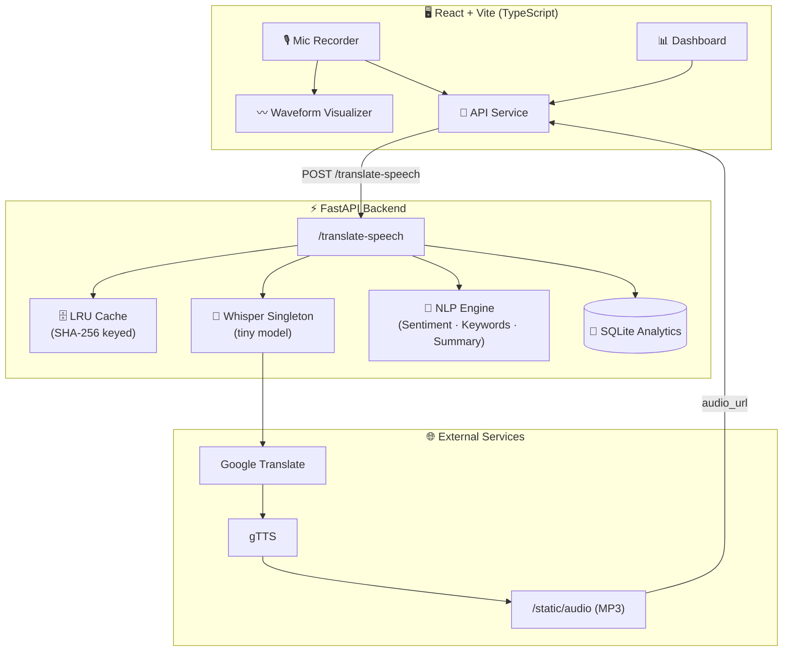
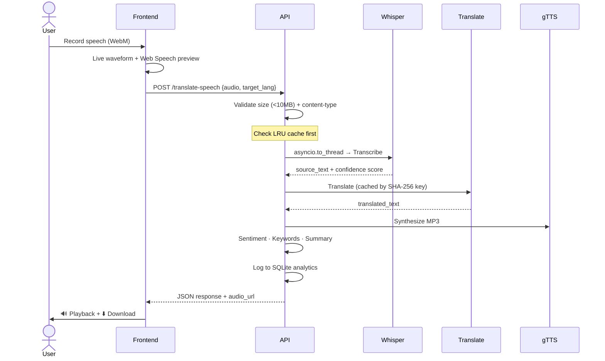

<div align="center">


<br/>

[](https://fastapi.tiangolo.com/)
[](https://react.dev/)
[](https://www.typescriptlang.org/)
[](https://github.com/openai/whisper)
[](https://www.docker.com/)
[](https://python.org)
[](LICENSE)

<br/>

> **Record your voice. Watch AI transcribe, translate, and speak it back — across 5 languages, in real time.**

<br/>

[🚀 Quick Start](#-installation) · [📡 API Docs](#-api-documentation) · [📊 Dashboard](#-dashboard) · [🏗️ Architecture](#%EF%B8%8F-architecture) · [🐳 Docker](#-deployment)

<br/>

---

</div>

## 🌟 What is StreamSpeech?

StreamSpeech is a **production-grade, full-stack AI application** that transforms spoken words into translated speech across multiple languages. It combines state-of-the-art AI models in a seamless 6-stage pipeline — all wrapped in a sleek glassmorphism UI with a real-time analytics dashboard.

**Built for:** portfolio showcasing · internship applications · AI/ML enthusiasts · multilingual communication

```
🎙️ Record  →  📝 Transcribe  →  🌍 Translate  →  🔊 Synthesize  →  📊 Analyze  →  ⬇️ Download
```

### Supported Languages

| Code | Language | Direction |
|------|----------|-----------|
| `en` | 🇬🇧 English | ↔ All |
| `hi` | 🇮🇳 Hindi | ↔ English, Tamil |
| `ja` | 🇯🇵 Japanese | → English |
| `es` | 🇪🇸 Spanish | ↔ English |
| `ta` | 🇮🇳 Tamil | ↔ Hindi |

---

## ✨ Features

<table>
<tr>
<td width="50%">

**🤖 AI & Speech**
- OpenAI Whisper ASR with auto language detection
- Confidence scoring for transcription quality
- Google Translate with LRU caching
- gTTS MP3 synthesis with download support
- Web Speech API live preview

</td>
<td width="50%">

**📊 Analytics & NLP**
- Sentiment analysis (positive / neutral / negative)
- Keyword extraction
- Auto-summarization
- Latency breakdown per pipeline stage
- SQLite-backed translation history

</td>
</tr>
<tr>
<td width="50%">

**🎨 Frontend UX**
- Live waveform visualization during recording
- 6-stage pipeline progress indicator
- Glassmorphism design system
- Responsive layout (desktop + mobile)
- One-click MP3 download

</td>
<td width="50%">

**⚙️ Backend & DevOps**
- FastAPI with async non-blocking pipeline
- Docker Compose for one-command deploy
- Health check endpoint
- Structured error responses
- CORS + upload validation

</td>
</tr>
</table>

---

## 📸 Screenshots

> Screenshots and a demo GIF will be added after the first public release. Run the app locally to see it in action!

To contribute screenshots, see the [Contribution Guide](#-contribution-guide).

---

## 🏗️ Architecture



## 🔄 AI Pipeline — Request Lifecycle



---

## 🚀 Installation

### Prerequisites

| Tool | Version | Notes |
|------|---------|-------|
| Python | 3.10+ | With pip |
| Node.js | 18+ | With npm |
| FFmpeg | Latest | Must be on PATH |
| Browser | Modern | Microphone access required |

### ⚡ Quick Start (Local Dev)

```bash
# 1. Clone the repository
git clone https://github.com/Aurora-st/Stream-speech-Multilanguage.git
cd Stream-speech-Multilanguage

# 2. Backend setup
cd backend
python -m venv venv

# Activate (choose your OS):
# Windows:  .\venv\Scripts\activate
# macOS/Linux: source venv/bin/activate

pip install -r requirements.txt
uvicorn main:app --reload --port 8000

# 3. Frontend setup (new terminal)
cd streamspeech
npm install
npm run dev
```

| Service | URL |
|---------|-----|
| Frontend | http://localhost:5173 |
| Backend API | http://127.0.0.1:8000 |
| API Docs (Swagger) | http://127.0.0.1:8000/docs |

### 📦 First Run — Model Download

On the first backend startup, Whisper automatically downloads the `tiny` model (~72 MB) to your local cache. This is **normal** and takes 30–90 seconds.

```
INFO: Downloading Whisper tiny model...
INFO: Model loaded successfully ✓
```

Optional model caches (SpeechBrain, HuggingFace) are stored in `backend/pretrained_models/` — created automatically by `cache_guard.py` when needed.

### 🔧 Environment Configuration

```bash
# Copy all example env files
cp .env.example .env
cp backend/.env.example backend/.env
cp streamspeech/.env.example streamspeech/.env
```

Key environment variables:

```env
# backend/.env
MAX_UPLOAD_BYTES=10485760   # 10 MB upload limit
CORS_ORIGINS=http://localhost:5173
WHISPER_MODEL=tiny          # Options: tiny, base, small, medium
```

---

## 📡 API Documentation

Interactive docs available at `http://127.0.0.1:8000/docs` (Swagger UI) when the backend is running.

### `GET /health`

Health check to verify all services are running.

```json
{
  "status": "ok",
  "whisper_model": "tiny",
  "cache_entries": 12,
  "database": "connected"
}
```

---

### `POST /translate-speech`

Transcribe, translate, and synthesize speech from an audio file.

**Request — `multipart/form-data`**

| Field | Type | Required | Description |
|-------|------|----------|-------------|
| `audio` | `file` | ✅ | WebM / OGG / WAV recording (max 10 MB) |
| `target_lang` | `string` | ✅ | `en`, `hi`, `ja`, `es`, `ta` |
| `source_lang` | `string` | ❌ | Omit for auto-detection |

**Supported Translation Pairs**

```
ja ↔ en    en ↔ hi    en ↔ es    hi ↔ ta
```

**Response**

```json
{
  "source_text": "Hello, how are you?",
  "translated_text": "नमस्ते, आप कैसे हैं?",
  "audio_url": "http://127.0.0.1:8000/static/audio/abc123.mp3",
  "detected_language": "en",
  "confidence": 0.87,
  "translation_confidence": 0.91,
  "sentiment": "neutral",
  "keywords": ["hello"],
  "summary": "Hello, how are you?",
  "audio_duration_ms": 3200,
  "cached": false,
  "latency": {
    "asr": 1200,
    "translation": 420,
    "tts": 980,
    "total": 2710
  }
}
```

---

### `GET /analytics/stats`

Aggregated dashboard metrics: total translations, success rate, average latency, top languages.

### `GET /analytics/history`

Paginated translation history with timestamps, language pairs, and sentiment.

---

## 📊 Dashboard

Navigate to `/dashboard` for a live analytics view:

- ✅ Total translations & success rate
- ⏱️ Average latency & audio duration
- 🌍 Most used language pair
- 📈 Interactive bar chart — latency breakdown
- 🥧 Sentiment pie chart
- 📋 Recent translation history with timestamps

---

## ⚡ Performance

| Optimization | Technique | Impact |
|---|---|---|
| Single model load | Whisper singleton via `lifespan` | Eliminates cold start per request |
| Non-blocking CPU | `asyncio.to_thread` for ASR | Keeps event loop free |
| Translation cache | LRU keyed by SHA-256(text + lang) | Skips API call on repeat input |
| Audio cache | SHA-256(audio bytes + lang) | Skips full pipeline on repeat audio |
| Fast model | Whisper `tiny` + tuned decode | Lower latency on CPU |

**Typical latency on CPU (4s audio clip):**

```
ASR: 800–2000ms  |  Translation: 200–600ms  |  TTS: 500–1200ms  |  Total: ~2700ms
```

---

## 🐳 Deployment

### Docker Compose (Recommended)

```bash
# Build and start all services
docker compose up --build

# Run in background
docker compose up -d --build
```

| Service | URL |
|---------|-----|
| Frontend | http://localhost:5173 |
| Backend | http://localhost:8000 |

### Production Build

```bash
# Frontend
cd streamspeech
npm run build
npm run preview

# Backend
cd backend
uvicorn main:app --host 0.0.0.0 --port 8000 --workers 2
```

> **Production Checklist:**
> - [ ] Restrict CORS origins in `.env`
> - [ ] Add rate limiting (e.g., `slowapi`)
> - [ ] Set up HTTPS reverse proxy (Nginx / Caddy)
> - [ ] Use persistent volume for SQLite in Docker

---

## 🔐 Security

| Measure | Detail |
|---------|--------|
| Upload size limit | Max 10 MB (`MAX_UPLOAD_BYTES`) |
| Content-type validation | Only audio formats accepted |
| Error handling | No stack traces exposed to client |
| CORS | Configurable via environment variable |
| Audio cleanup | Temp files removed after processing |

---

## 🗺️ Roadmap

- [ ] **WebSocket streaming ASR** — word-by-word live transcription
- [ ] **MarianMT local translation** — offline, no API dependency (module included)
- [ ] **Redis distributed cache** — scalable multi-instance caching
- [ ] **Voice cloning** — XTTS module (available, not wired up)
- [ ] **PWA support** — installable mobile app
- [ ] **More languages** — French, German, Korean, Arabic
- [ ] **Real screenshots & demo GIF** in README

---

## 🤝 Contribution Guide

Contributions are welcome! Here's how to get started:

```bash
# 1. Fork the repository on GitHub
# 2. Clone your fork
git clone https://github.com/<your-username>/Stream-speech-Multilanguage.git

# 3. Create a feature branch
git checkout -b feature/your-feature-name

# 4. Make changes, then validate
cd streamspeech && npm run build
cd backend && python -m pytest  # if tests exist

# 5. Commit with a clear message
git commit -m "feat: add WebSocket streaming support"

# 6. Push and open a Pull Request
git push origin feature/your-feature-name
```

**PR Checklist:**
- [ ] All files inside the project root
- [ ] Frontend builds without errors (`npm run build`)
- [ ] Backend starts without errors
- [ ] PR description includes what changed and why
- [ ] Screenshots or test output attached (if UI change)

---

## 📁 Project Structure

```
Stream-speech-Multilanguage/
├── backend/
│   ├── main.py              # FastAPI app, routes, pipeline
│   ├── cache_guard.py       # LRU cache + model caching
│   ├── requirements.txt
│   └── .env.example
├── streamspeech/            # React + Vite frontend
│   ├── src/
│   │   ├── components/      # UI components
│   │   ├── pages/           # Routes: Home, Dashboard
│   │   └── services/        # API client
│   ├── package.json
│   └── .env.example
├── docs/
│   └── PORTFOLIO.md         # Resume blurbs, interview prep
├── docker-compose.yml
└── README.md
```

---

## 📄 License

MIT License — see [LICENSE](LICENSE) for details.

Built with ❤️ using [OpenAI Whisper](https://github.com/openai/whisper), [Google Translate](https://pypi.org/project/googletrans/), [gTTS](https://gtts.readthedocs.io/), [FastAPI](https://fastapi.tiangolo.com/), and [React](https://react.dev/).

---

<div align="center">


**⭐ If this project helped you, consider giving it a star!**

[🐛 Report Bug](https://github.com/Aurora-st/Stream-speech-Multilanguage/issues) · [💡 Request Feature](https://github.com/Aurora-st/Stream-speech-Multilanguage/issues) · [📧 Contact](https://github.com/Aurora-st)

</div>
