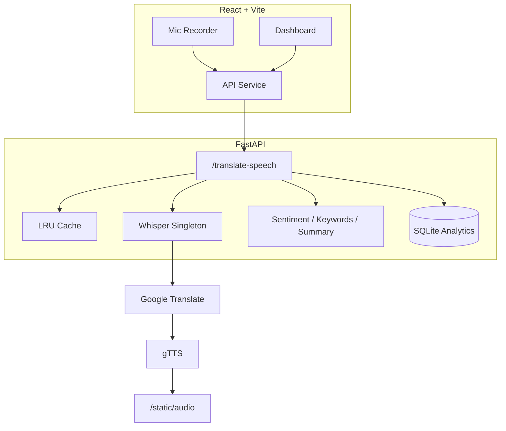
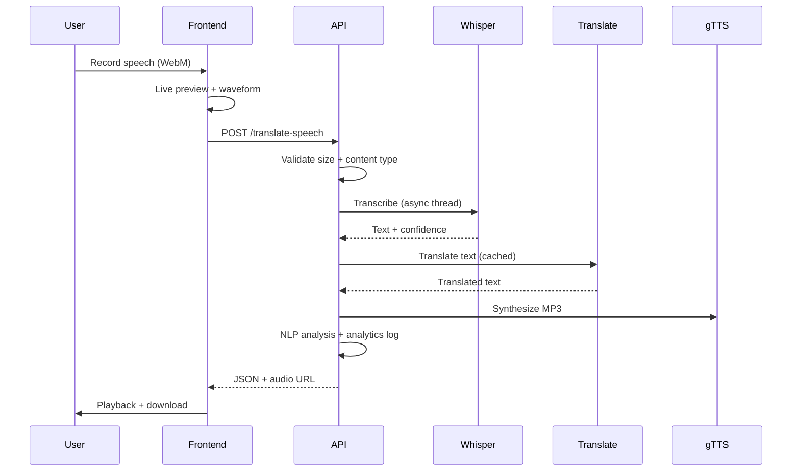

# StreamSpeech

[](https://fastapi.tiangolo.com/)
[](https://react.dev/)
[](https://github.com/openai/whisper)
[](https://www.typescriptlang.org/)
[](https://www.docker.com/)
[](LICENSE)

> **Real-time multilingual speech translation powered by Whisper, Google Translate, and gTTS — with AI analytics, glassmorphism UI, and production-ready FastAPI backend.**

[Live Demo](#) · [Dashboard](#dashboard) · [API Docs](#api-documentation) · [Architecture](#architecture) · [Portfolio Guide](docs/PORTFOLIO.md)

---

## Hero

StreamSpeech is a full-stack AI application that converts spoken language into translated text and synthesized audio across **English, Hindi, Japanese, Spanish, and Tamil**. Built for portfolio showcase, internship applications, and production deployment.

**Record → Transcribe → Translate → Synthesize → Analyze**

---

## Features

| Category | Capabilities |
|---|---|
| **Speech AI** | Whisper ASR, auto language detection, confidence scoring |
| **Translation** | Google Translate with LRU caching |
| **Speech Synthesis** | gTTS MP3 output with download |
| **NLP Analytics** | Sentiment, keywords, summarization |
| **Real-Time UX** | Live waveform, Web Speech preview, 6-stage pipeline |
| **Dashboard** | Latency charts, success rate, history, sentiment pie chart |
| **DevOps** | Docker Compose, health checks, env configuration |

---

## Screenshots

Screenshots will be added in a future update.

## Architecture



## AI Pipeline



---

## Installation

### Prerequisites

- Python 3.10+
- Node.js 18+
- FFmpeg on PATH
- Microphone access (HTTPS or localhost)

### Quick Start

```bash
# Backend
cd backend
pip install -r requirements.txt
uvicorn main:app --reload --port 8000

# Frontend (new terminal)
cd streamspeech
npm install
npm run dev
```

Open http://localhost:5173 · API at http://127.0.0.1:8000

### First Run — Model Download

Model weights are **not stored in Git** (they are large and auto-downloaded).

On the first backend startup, OpenAI Whisper downloads the `tiny` model (~72 MB) to your local cache. This is normal and takes 30–90 seconds depending on your connection.

```bash
# Recommended: use a virtual environment
cd backend
python -m venv venv
# Windows: .\venv\Scripts\activate
pip install -r requirements.txt
uvicorn main:app --reload --port 8000
```

Optional model caches (SpeechBrain, HuggingFace) are stored in `backend/pretrained_models/` at runtime — created automatically by `cache_guard.py` when needed.

### Environment

Copy `.env.example` to configure:

```bash
cp .env.example .env          # Root reference
cp backend/.env.example backend/.env
cp streamspeech/.env.example streamspeech/.env
```

---

## API Documentation

### `GET /health`

```json
{ "status": "ok", "whisper_model": "tiny", "cache_entries": 0, "database": "connected" }
```

### `POST /translate-speech`

| Field | Type | Required | Description |
|---|---|---|---|
| `audio` | file | Yes | WebM/OGG/WAV recording |
| `target_lang` | string | Yes | `en`, `hi`, `ja`, `es`, `ta` |
| `source_lang` | string | No | Auto-detect if omitted |

**Supported pairs:** ja→en, en→hi, hi→en, en→es, es→en, ta→hi, hi→ta

**Response:**

```json
{
  "source_text": "Hello, how are you?",
  "translated_text": "नमस्ते, आप कैसे हैं?",
  "audio_url": "http://127.0.0.1:8000/static/audio/abc123.mp3",
  "detected_language": "en",
  "confidence": 0.87,
  "translation_confidence": 0.91,
  "sentiment": "neutral",
  "keywords": ["hello"],
  "summary": "Hello, how are you?",
  "audio_duration_ms": 3200,
  "cached": false,
  "latency": { "asr": 1200, "translation": 420, "tts": 980, "total": 2710 }
}
```

### `GET /analytics/stats` · `GET /analytics/history`

Dashboard metrics including success rate, latency breakdown, and translation history.

---

## Dashboard

Navigate to `/dashboard` for:

- Total translations and **success rate**
- Average latency and audio duration
- Most used language
- Interactive bar and pie charts
- Recent translation history with timestamps

---

## Performance Metrics

| Optimization | Impact |
|---|---|
| Whisper singleton (lifespan) | Model loads once |
| `asyncio.to_thread` | Non-blocking CPU work |
| LRU cache (text + audio) | Skip redundant processing |
| Whisper `tiny` + tuned decode | Faster ASR |

Typical latency (CPU, ~4s audio): ASR 800–2000ms · Translation 200–600ms · TTS 500–1200ms

---

## Deployment Guide

### Docker Compose

```bash
docker compose up --build
```

- Frontend: http://localhost:5173
- Backend: http://localhost:8000

### Production Build

```bash
cd streamspeech && npm run build && npm run preview
cd backend && uvicorn main:app --host 0.0.0.0 --port 8000
```

---

## Security Notes

- Upload size limited to 10 MB (`MAX_UPLOAD_BYTES`)
- Content-type validation on audio uploads
- Structured error responses (no stack traces to client)
- CORS configurable via environment
- **Production:** restrict CORS, add rate limiting, use HTTPS reverse proxy

---

## Portfolio: System Design

### AI Workflow

Audio → FFmpeg conversion → Whisper ASR → Google Translate → gTTS → NLP analysis → cache + analytics persistence.

### Caching Strategy

- **Text cache:** SHA-256(source + lang pair) for translation dedup
- **Audio cache:** SHA-256(audio bytes + lang pair) for full pipeline skip
- **TTL:** Configurable LRU with hit-rate tracking

### Scalability

Stateless API with SQLite analytics. Upgrade path: Redis cache, PostgreSQL, S3 storage, WebSocket streaming.

See [docs/PORTFOLIO.md](docs/PORTFOLIO.md) for resume descriptions, interview prep, and GitHub topics.

---

## Future Scope

- WebSocket streaming ASR
- MarianMT local translation (module included)
- Redis distributed cache
- Voice cloning (XTTS module available)
- PWA / mobile support

---

## Contribution Guide

1. Fork [Aurora-st/Stream-speech-Multilanguage](https://github.com/Aurora-st/Stream-speech-Multilanguage.git)
2. Create a feature branch
3. Keep all files inside the project root
4. Run `npm run build` and backend validation
5. Open a PR with test plan

---

## License

MIT — Built with Whisper, Google Translate, gTTS, FastAPI, and React.
