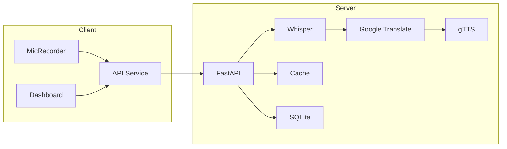

# StreamSpeech Architecture

See the main [README.md](../README.md) for full documentation.

## Component Diagram

## Data Flow

1. Browser captures WebM audio via MediaRecorder
2. Frontend uploads multipart form to `/translate-speech`
3. Backend checks LRU cache → miss proceeds to pipeline
4. FFmpeg converts WebM → WAV
5. Whisper transcribes with confidence scoring
6. Google Translate translates text (with text-level cache)
7. gTTS generates MP3 to `static/audio/`
8. NLP extracts sentiment, keywords, summary
9. Result cached and persisted to SQLite analytics
10. Frontend displays results, plays audio, updates dashboard
